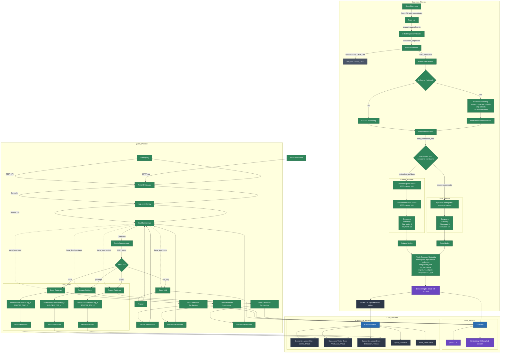

# CodeRAG: Intelligent Code Repository Assistant

A specialized RAG (Retrieval Augmented Generation) system for intelligent code repository analysis and assistance. CodeRAG ingests repositories, builds vectorized knowledge bases, and provides contextual AI responses about repository structure, functionality, and implementation details.

## 🌟 Features

- **Repository Ingestion**: Efficiently analyzes GitHub repositories with specialized handling for different file types
- **Smart Notebook Processing**: Intelligently filters out boilerplate and execution noise from Jupyter notebooks
- **Hierarchical Analysis**: Creates summaries at repository, directory, and file levels
- **Context-Aware Queries**: Intelligently routes questions to the most relevant context (high-level overviews vs. code-specific details)
- **Cassandra Vector Storage**: Scalable persistence for embeddings using Cassandra
- **Kubernetes Deployment**: Complete Helm chart for easy deployment

## 🏗️ Architecture

## 🚀 Getting Started

### Prerequisites

- Minikube or Kubernetes cluster
- Docker
- Helm
- GitHub API token (for repository access)

### Setup

1. **Start the local environment:**
Start script currently only available for windows. 
```shell
   .\start.ps1
```

2. **Create GitHub token secret:**

   ```shell
   kubectl -n rag create secret generic github-token \
     --from-literal=token=your_github_token_here
   ```

3. **Access the web interface:**
   - Frontend: http://localhost:3000
   - API: http://localhost:8000

## 📝 Usage

### Ingesting a Repository

You can ingest a repository by using the CLI tool or the API:

```shell
# Using the CLI
kubectl -n rag exec -it deployment/rag-ingest -- python /app/llama_ingest.py --repo username/repository

# Using the API
curl -X POST http://localhost:8000/ingest -H "Content-Type: application/json" \
  -d '{"repo_url": "https://github.com/username/repository"}'
```

### Querying the System

```shell
# API example
curl -X POST http://localhost:8000/rag -H "Content-Type: application/json" \
  -d '{"query": "Explain the authentication flow in this repository"}'
```

## 🧠 Intelligent Query Handling

CodeRAG uses sophisticated query classification to provide the most relevant context:

- **High-Level Queries** like "Explain the architecture" or "Give an overview of the auth system" retrieve repository and directory summaries first.

- **Code-Specific Queries** like "How is the login function implemented?" or "What parameters does the API endpoint accept?" focus on retrieving code chunks.

## 🔧 Development

### Environment Setup

The project uses two Conda environments:

1. **Ingest Environment** (environment-scripts.yml): 
   - Used for repository ingestion and processing
   - Includes notebook processing tools and GitHub integration

2. **Service Environment** (environment-service.yml):
   - Used for the API service
   - Optimized for query processing and response generation

### Building From Source

```shell
# Build ingest container
docker build -t rag-ingest:latest -f scripts/Dockerfile .

# Build API container
docker build -t rag-api:latest -f services/rag_api/Dockerfile .

# Build frontend
cd frontend/nextjs-app
docker build -t rag-frontend:latest .
```

## 📚 Project Structure

- `/scripts` - Repository ingestion tools
- `/services/rag_api` - REST API for querying the system
- `/frontend` - Web interface
- `/helm` - Kubernetes deployment manifests

## 📦 Technologies

- **LlamaIndex**: Core RAG functionality
- **Sentence Transformers**: Text embeddings
- **vLLM**: Optimized LLM inference
- **Cassandra**: Vector database
- **FastAPI**: REST API
- **Kubernetes**: Deployment and orchestration

## 🤝 Contributing

Contributions are welcome, although this project is still in the non-functional MVP build out stage scheduled to be completed by August 15 2025.

## 📄 License

This project is licensed under the Apache License - see the LICENSE file for details.
