# CodeRAG: Intelligent Code Repository Assistant

A specialized RAG (Retrieval Augmented Generation) system for intelligent code repository analysis and assistance. CodeRAG ingests repositories, 
builds vectorized knowledge bases, and provides contextual AI responses about repository structure, functionality, and implementation details.

This project is intended in the first part of the arrange phase of LLM execution 

## 🌟 Features

- **Repository Ingestion**: Efficiently analyzes GitHub repositories with specialized handling for different file types
- **Smart Notebook Processing**: Intelligently filters out boilerplate and execution noise from Jupyter notebooks
- **Hierarchical Analysis**: Creates summaries at repository, directory, and file levels
- **Context-Aware Queries**: Intelligently routes questions to the most relevant context (high-level overviews vs. code-specific details)
- **Cassandra Vector Storage**: Scalable persistence for embeddings using Cassandra
- **Kubernetes Deployment**: Complete Helm chart for easy deployment

## 🏗️ Architecture

### System level diagram

### Workflow level diagram

```mermaid
graph TD

%% ====== Styles ======
    classDef svc fill:#2b6cb0,stroke:#1a365d,color:#ffffff
    classDef llm fill:#6b46c1,stroke:#44337a,color:#ffffff
    classDef cass fill:#2d3748,stroke:#4a5568,color:#e2e8f0
    classDef pipe fill:#2f855a,stroke:#22543d,color:#ffffff
    classDef note fill:#4a5568,stroke:#2d3748,color:#e2e8f0
    classDef infra fill:#22543d,stroke:#1b3a2a,color:#e2e8f0
    classDef control fill:#805ad5,stroke:#553c9a,color:#ffffff

%% ===========================
%% Ingestion Pipeline
%% ===========================
    subgraph Ingestion_Pipeline
        direction TB
        R0[Repo Discovery]:::pipe -->|GraphQL fetch_repositories| R1[Repo List]:::pipe
        R1 -->|for each repo or branch| A[GithubRepositoryReader]:::pipe
        A -->|concurrent_requests 6| B[Raw Documents]:::pipe
        B -->|optional dump DATA_DIR| Bdump[raw_documents_*.json]:::note
        B -->|filter_documents| C[Filtered Documents]:::pipe

        C --> D{Is Jupyter Notebook?}:::pipe
        D -- Yes --> JN[Notebook Handling<br/>remove noise and outputs<br/>strip artifacts<br/>flag as standalone]:::pipe
        D -- No --> ND[Generic Processing]:::pipe

        JN --> NBD[Normalized Notebook Docs]:::pipe
        ND --> J[Preprocessed Docs]:::pipe
        NBD --> J
        J -->|infer_component_kind| CK{Component Kind<br/>service vs standalone}:::pipe

        subgraph Catalog_Pipeline
            direction TB
            CP0[SentenceSplitter<br/>chunk 1500 overlap 100]:::pipe
            CP1[SimpleNodeParser<br/>chunk 1500 overlap 100]:::pipe
            CP2[Extractors<br/>Summary<br/>Title nodes 3<br/>Keywords 10]:::pipe
        end

        subgraph Code_Pipeline
            direction TB
            DP0[DynamicCodeSplitter<br/>language inferred]:::pipe
            DP1[Extractors<br/>Summary<br/>Title nodes 5<br/>Keywords 10]:::pipe
        end

        CK -->|routes text and docs| CP0
        CK -->|routes source code| DP0
        CP0 --> CP1 --> CP2 --> Ncat[Catalog Nodes]:::pipe
        DP0 --> DP1 --> Ncode[Code Nodes]:::pipe

        M0[Attach Common Metadata<br/>namespace, repo, branch, collection<br/>component_kind, is_standalone<br/>ingest_run_id, path, language, doc_type]:::pipe
        Ncat --> M0
        Ncode --> M0
        M0 --> M1[Embedding E5 Small V2<br/>dim 384]:::llm
        M1 --> F[Vector DB Upsert<br/>to level tables]:::cass
    end

%% ===========================
%% Query Pipeline with Iterative Refinement
%% ===========================
subgraph Query_Pipeline
direction TB

U[User Query]:::pipe -->|HTTP REST| API[REST API - FastAPI<br/>app/main.py]:::svc

%% --- API Layer & Endpoints ---
subgraph REST_API_Service
direction TB
JR[JobsController<br/>app/controllers/jobs_controller.py]:::svc
JR -->|POST /rag/jobs<br/>enqueue| ENQ[enqueue_job<br/>name: run_rag_job<br/>args: job_id, QueryRequest]:::pipe
JR -->|GET /rag/jobs/:job_id/events<br/>SSE| SSE[SSE Stream -> client]:::pipe
JR -->|POST /rag/jobs/:job_id/cancel| CXL[set CancelFlags]:::pipe
end
API --> JR

%% --- Redis as queue + event bus ---
RQ[Redis<br/>ARQ queue / ProgressBus / CancelFlags]:::infra
ENQ -->|job payload<br/>query, force_level?, top_k?, repo_name?| RQ
CXL -->|cancel signal| RQ
RQ -->|SSE chunks<br/>bus.stream| SSE
SSE --> U

%% --- Worker Side Orchestrator ---
subgraph RAG_Worker_Service
direction TB
W[ARQ Worker<br/>worker/worker.py::run_rag_job]:::svc
ENG[RAGEngine<br/>worker/services/rag_engine.py]:::svc
ROUTER[RouterService<br/>worker/services/router_service.py]:::svc

%% Refinement Controller inside RAGEngine
subgraph REFINER[Refinement Controller]
direction TB
POL[Refinement Policy<br/>max_iterations = 3<br/>no quality threshold<br/>fixed retrieval params]:::control
PROMPT[Prompt Builder<br/>system  context  tools  style]:::control
CRIT[Self-Critique / Scorer<br/>LLM-as-judge - Qwen]:::control
ITER{more iterations remaining?}:::control
end
end

RQ -->|dequeue run_rag_job| W
W -->|attempt loop<br/>retry until MIN_SOURCE_NODES or limit| ENG
ENG -->|route: query, force_level| ROUTER
W -->|emit progress and tokens<br/>ProgressBus.emit: job_id, ...| RQ

%% --- Routed Tools / Retrieval ---
subgraph RAG_Tools
direction TB
NR[Direct LLM - no_rag<br/>DummyQueryEngine]:::pipe
CODE[Code Retriever]:::pipe
PKG[Package Retriever]:::pipe
PROJ[Project Retriever]:::pipe

CODE --> CR[VectorIndexRetriever<br/>top_k = ROUTER_TOP_K]:::pipe
CR --> CIDX[VectorStoreIndex<br/>CODE_TABLE]:::pipe

PKG --> PR[VectorIndexRetriever<br/>top_k = ROUTER_TOP_K]:::pipe
PR --> PIDX[VectorStoreIndex<br/>PACKAGE_TABLE]:::pipe

PROJ --> VRP[VectorIndexRetriever<br/>top_k = ROUTER_TOP_K]:::pipe
VRP --> JIDX[VectorStoreIndex<br/>PROJECT_TABLE]:::pipe

%% Synthesizers and Answers
NR --> A0[Draft Answer v0]:::pipe
CODE --> S1[TreeSummarize Synthesizer]:::pipe
PKG --> S2[TreeSummarize Synthesizer]:::pipe
PROJ --> S3[TreeSummarize Synthesizer]:::pipe
S1 --> A1[Draft Answer v1]:::pipe
S2 --> A2[Draft Answer v1]:::pipe
S3 --> A3[Draft Answer v1]:::pipe
end

ROUTER -->|LLM routing: no_rag / code / package / project| NR
ROUTER --> CODE
ROUTER --> PKG
ROUTER --> PROJ

%% Allow route change during refinement
CRIT -. may re-route based on critique .-> ROUTER

%% ===========================
%% Iterative Reprompting Loop (3 fixed iterations or cancel)
%% ===========================
A0 -->|evaluate| CRIT
A1 -->|evaluate| CRIT
A2 -->|evaluate| CRIT
A3 -->|evaluate| CRIT

CRIT -->|score and feedback| POL
POL -->|refine plan| PROMPT
PROMPT -->|assemble messages + context| CALL[(Call Qwen LLM)]:::llm
CALL --> RESP[Model Response - answer and citations]:::llm
RESP -->|append to working draft| DRAFT[Refined Answer v_k]:::pipe
DRAFT --> CRIT
CRIT --> ITER
ITER -- Yes --> PROMPT
ITER -- No --> FINAL[Final Answer + sources]:::pipe

%% Worker returns answers as streamed events
DRAFT --> W
FINAL --> W
W -->|stream tokens, progress, drafts, final| RQ

end

%% ===========================
%% Core Services (reference)
%% ===========================
subgraph Core_Services
direction TB

subgraph LLM_Services
direction TB
LLM_BUS[LLM Hub]:::svc
QWEN[Qwen LLM<br/>worker/services/qwen_llm.py]:::llm
EMB_NODE[Embedding E5 Small V2<br/>dim 384]:::llm
LLM_BUS --> QWEN
LLM_BUS --> EMB_NODE
end

subgraph Cassandra_Services
direction TB
CASS_BUS[Cassandra Hub]:::svc
V_CODE[Cassandra Vector Store<br/>CODE_TABLE]:::cass
V_PKG[Cassandra Vector Store<br/>PACKAGE_TABLE]:::cass
V_PROJ[Cassandra Vector Store<br/>PROJECT_TABLE]:::cass
AUD1[ingest_runs table]:::cass
AUD2[node_count rollup]:::cass
CASS_BUS --> V_CODE
CASS_BUS --> V_PKG
CASS_BUS --> V_PROJ
CASS_BUS --> AUD1
CASS_BUS --> AUD2
end
end

%% LLM usage
NR --- LLM_BUS
S1 --- LLM_BUS
S2 --- LLM_BUS
S3 --- LLM_BUS
M1 --- LLM_BUS
CALL --- QWEN

%% Cassandra usage
CIDX --- V_CODE
PIDX --- V_PKG
JIDX --- V_PROJ
F --- CASS_BUS

%% External client
WEB[Web UI or Client]:::pipe -->|HTTP rag| API

%% ====== Legend & Notes ======
LEG1[Legend<br/>Iterative loop: Build -> LLM -> Judge -> Decide<br/>Stop conditions: iteration count = 3 or cancel]:::note
LEG2[Events<br/>- ProgressBus emits: phase, score, tokens_used, iteration k<br/>- SSE streams: partial tokens, draft updates, final answer<br/>- Intermediate drafts/scores are streamed only not persisted]:::note

```

# 🚀 Getting Started

This section walks you through standing up CodeRAG locally with **Windows + PowerShell** as the primary path. 
Linux may work, but it hasn’t been tested.

> **GPU is required.** CPU fallback is **not** supported due to the vLLM container constraints. You’ll need an NVIDIA GPU with **≥ 8 GB** VRAM and CUDA drivers installed.

## Prerequisites

* **OS**: Windows 10/11 (PowerShell 7+). *Linux/macOS may work but are untested.*
* **Hardware**: >= 4 CPU cores (8 recommended), >= 16 GB RAM, **NVIDIA GPU (≥ 8 GB VRAM)** with CUDA drivers
* **Software**: Docker Desktop, Minikube, kubectl, Helm, Git
* **GitHub**: Fine‑grained **Personal Access Token (PAT)** with **read‑only** scope (to avoid low unauthenticated rate limits)

## One‑time setup

1. **Install prerequisites**

    * Install Docker Desktop and enable Kubernetes/WSL2 integration if prompted
    * Install Minikube, kubectl, and Helm from their official sites
    * Ensure your GPU drivers and CUDA are installed and recognized by Docker (e.g., `docker run --gpus all nvidia/cuda:12.1.0-base nvidia-smi`)

2. **Create a GitHub fine‑grained token (read‑only)**

    * Go to GitHub → *Settings* → *Developer settings* → *Fine‑grained tokens*
    * Scope: **Read‑only** for public repositories is sufficient for quickstarts
    * Keep the token ready—you’ll be prompted for it during setup (recommended; unauthenticated 60/hr is too low)

3. **Clone this repo**

   ```powershell
   git clone https://github.com/jasonbuchanan145/GithubReposToRag.git
   cd GithubReposToRag
   ```

---

## Start the local environment

The project provides a script that prepares Minikube, builds all images locally from source, and installs the Helm chart.

### Run (Windows + PowerShell)

```powershell
# Option A: prompt for the GitHub user interactively
./start.ps1

# Option B: pass the GitHub user up front
./start.ps1 -GithubUser "jasonbuchanan145"
```

What the script does (high level):

* Starts Minikube with GPU support and resources (recommended defaults):
    * `--gpus=all --cpus=8 --memory=16g` *(minimum: 4 CPUs are OK, but other requirements remain)*
* Enables addons: `ingress`, `default-storageclass`, `storage-provisioner`, `volumesnapshots`
* Builds & loads local Docker images into Minikube registry:

    * `rag-ingest`, `rag-api`, `rag-frontend`
* Creates/uses namespace: `rag`
* Prompts for your **GitHub username** and a **fine‑grained PAT** (read‑only) and stores it in `rag` namespace as secret `github-token`
* Installs Helm release `rag-demo` with images tagged `dev`

    * **Cassandra persistence is enabled by default**

> **Disabling persistence (optional)**: For quick tests you can disable Cassandra persistence by setting the flag in the script (or with Helm values). See the examples below.

---

## Accessing the Web UI

After the deployment completes, expose the API service via Minikube and open the UI:

```powershell
minikube service rag-api -n rag
```

Click the URL that Minikube prints and navigate to:

```
/static/index.html
```

[](images/ui-full.png)


---

# Usage

## Ingesting GitHub repositories

The system’s **ingestion job** pulls repositories for the GitHub user you provided and indexes content into Cassandra for retrieval.

**When using the script**

* The Helm chart is installed with `--set github.user=<YourUser>`. This triggers ingestion using the `github-token` secret you provided.
* For smoke testing, you can set `-GithubUser "jasonbuchanan145"` (public repos available).

**If you need to re‑ingest** (e.g., changed the GitHub user/token):

* Re‑run the script with a different `-GithubUser`
* Or uninstall the release and reinstall with a new value (see Cleanup below)

> Tip: Keep your token read‑only. The system only needs read access for public repos.

## Querying

You can query via **Web UI** *and* **direct API**.

### 1) Web UI (recommended for first‑time users)

* Open the UI at `/static/index.html` from the `rag-api` Minikube URL
* Enter a question and select any available options the UI provides
* Responses stream back with citations where applicable

### 2) Direct API

The API is served by the `rag-api` service. Endpoints of interest:

* **POST** `/rag/jobs` — enqueue a RAG job
* **GET** `/rag/jobs/{job_id}/events` — Server‑Sent Events (SSE) stream with progress, partial tokens, and final answer
* **POST** `/rag/jobs/{job_id}/cancel` — request cancellation

**Example: enqueue a query**

```bash
curl -X POST "<rag-api-base>/rag/jobs" \
  -H "Content-Type: application/json" \
  -d '{
        "query": "Give me an overview of the architecture.",
        "top_k": 5
      }'
```

This returns a `job_id`. Then stream events:

```bash
curl -N "<rag-api-base>/rag/jobs/<job_id>/events"
```

> Notes
>
> * The system routes between high‑level (project/package) and code‑level retrieval automatically and may iterate a few times before finalizing an answer.
> * SSE includes progress, partial tokens, and draft updates

---

# ⚙️ Configuration & Helm

The script installs the Helm chart with sensible defaults for local development. Under the hood it runs roughly:

```powershell
helm install rag-demo ./helm -n rag `
  --set image.tag=dev `
  --set image.pullPolicy=IfNotPresent `
  --set github.user=<YourUser>
```

**Cassandra persistence** is **enabled by default**. To disable persistence (faster, ephemeral testing), install with:

```powershell
helm install rag-demo ./helm -n rag `
  --set image.tag=dev `
  --set image.pullPolicy=IfNotPresent `
  --set cassandra.persistence.enabled=false `
  --set github.user=<YourUser>
```

> If you modify values directly, ensure the `github-token` secret exists in the `rag` namespace: `kubectl -n rag create secret generic github-token --from-literal=token=<PAT>`

---

# 🧪 Quick smoke test

1. Start with your own GitHub username or use the example user:

   ```powershell
   ./start.ps1 -GithubUser "jasonbuchanan145"
   ```
2. Expose and open the API service, then browse to `/static/index.html`:

   ```powershell
   minikube service rag-api -n rag
   ```
3. Check the status of the ingestion job:
```powershell
kubectl get pod -n rag
```
then 
```powershell
kubectl logs -n rag <ingestion-pod-name>
```
---

# Development notes

* **Builds from source.** There are no prebuilt images; the script builds and loads them into Minikube automatically.
* **Resource tuning.** Minimum: 4 CPU cores; recommended: 8 CPUs / 16GB RAM. **GPU with ≥ 8GB VRAM required.**
* **Linux/macOS** may work but are **not tested**; equivalent steps would involve running the same Helm chart on a local K8s with GPUs and building images for that cluster.

---

# 🧹 Cleanup

To remove the deployment while leaving Minikube running:

```powershell
helm uninstall rag-demo -n rag
kubectl delete namespace rag
```

To remove the Minikube VM/containers entirely:

```powershell
minikube delete
```

---

# 📖 What we intentionally skipped

* **Troubleshooting**: none provided yet. If you hit PVC binding or Cassandra readiness issues, 
re‑run the script or reinstall with persistence disabled as a quick test.

Please [open an issue](https://github.com/jasonbuchanan145/GithubReposToRag/issues) if you run into any problems.

---

# 📌 Recap of key choices

* **Primary platform**: Windows + PowerShell (Linux untested)
* **Local environment**: **Minikube only**
* **Images**: **Built from source** via the script
* **Cassandra**: Persistence **enabled by default** (example provided to disable)
* **Access**: Use `minikube service rag-api -n rag` and then open `/static/index.html`
* **GitHub token**: Fine‑grained, **read‑only**; required for realistic rate limits
* **Example user**: `jasonbuchanan145`
* **Resources**: 4 CPUs minimum (8 recommended), 16 GB RAM recommended, **GPU ≥ 8 GB VRAM required**, **no CPU fallback**

## 📄 License

This project is licensed under the Apache License 2.0 - see the LICENSE file for details.
